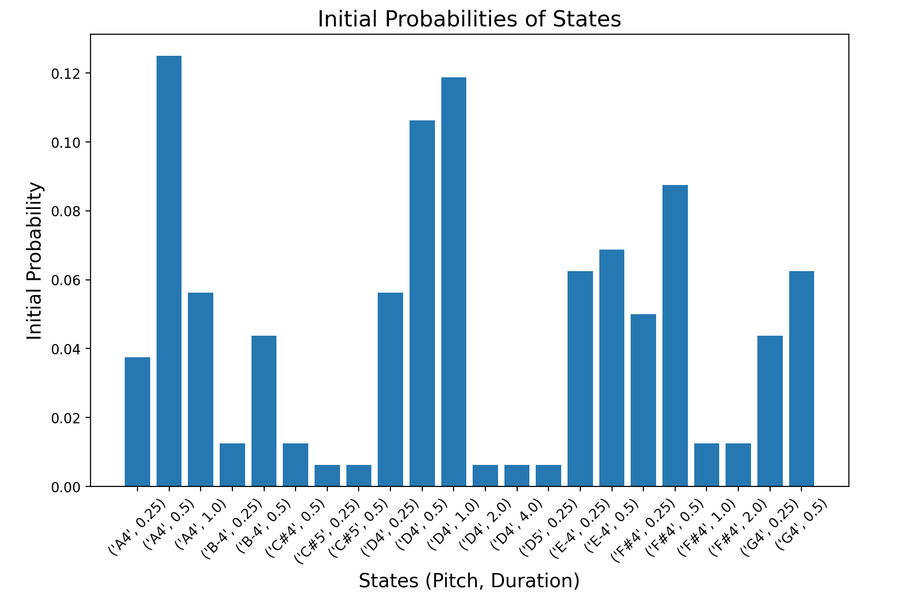
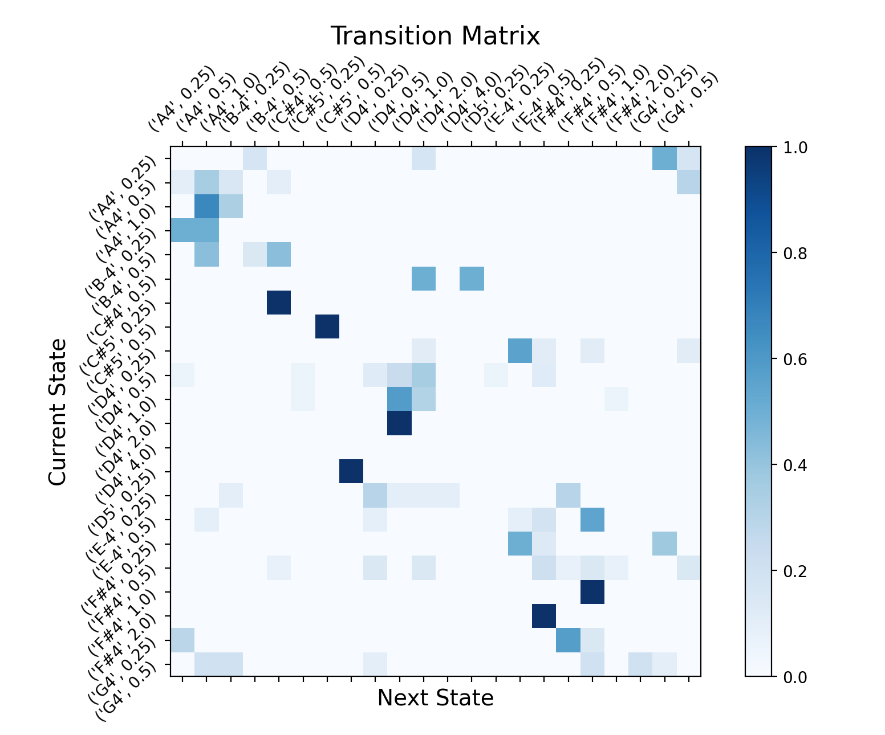

# Raag-Bhairav-composition-by-GEN-AI_Markov-Chain

This project generates new musical melodies using a **Markov Chain-based model** trained on a MIDI file. It analyzes the note sequences and durations from the input, learns transition probabilities between states (notes + durations), and creates new melodies that stylistically resemble the input. 

Currently, the code is tested with an Indian Raag called **Raag Bhairav** as a training source, but you can use any monophonic MIDI file to generate melodies in that style.

---

## 📦 Features

- Train a first-order Markov model using note pitch and duration as states
- Generate new melodies with a specified time signature and number of measures/bars
- Visualize:
  - Initial state probabilities
  - Transition matrix as a heatmap
- Export the generated melody to **MusicXML** and open it in MuseScore or any music notation software

---

## 🔧 Requirements

- Python 3.7+
- [MuseScore 3](https://musescore.org/) (to render MusicXML output)
- Python packages:
  - `music21`
  - `numpy`
  - `matplotlib`

## 🚀 How to Run

    1. Update MuseScore Path
      Modify this line if MuseScore is installed elsewhere:
  
      us['musicxmlPath'] = '/Applications/MuseScore 3.app/Contents/MacOS/mscore'
    2. Update the Midi Path and Key if you want to train a a different Raag/music

    3. Run the Script
  
      Raag Bhairav composition by GEN AI_Markov Chain.ipynb
      
    4. Provide Time Signature
      
      When prompted, enter a time signature such as:

      Enter the time signature (e.g., 4/4, 3/4): 4/4

    4. Output

        MusicXML file opens in MuseScore

        Matplotlib shows:

            Initial state probability bar chart

            Transition matrix heatmap

## 🎼 How It Works

    States are defined as tuples of (pitch name + octave, duration in quarterLength), e.g., ('D4', 1.0).

    Initial probabilities reflect how often each state starts a melody. But I have not used this, as I wanted to start the melody in the root key. D4 in this case!

    Transition matrix defines probabilities of going from one state to another.

    Generation begins with a key (starting note) and randomly walks through the model until a desired total beat count is reached.

## 📊 Visualizations

    Initial State Probabilities
    
    
    Displays how often each note-duration pair starts a melody in the training data.
    
    Transition Matrix
    
     
    Heatmap showing likelihood of transitions between all pairs of states.

## 🧠 Future Improvements

    Add rest support and note articulations

